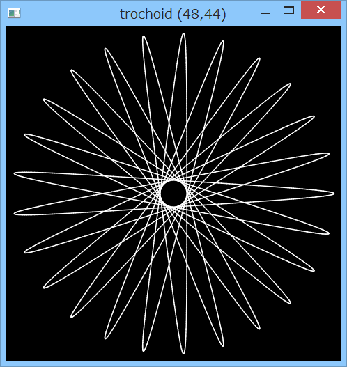
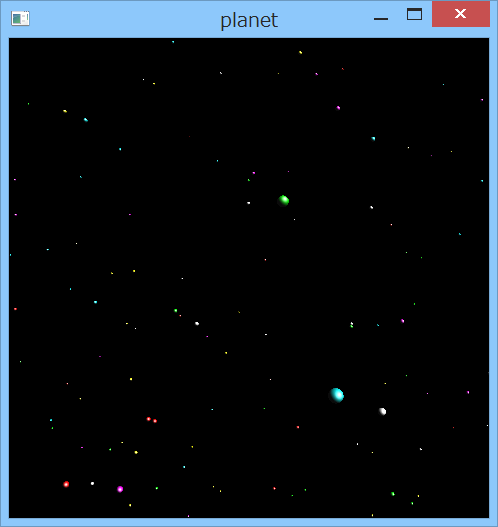
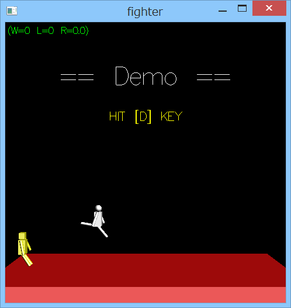
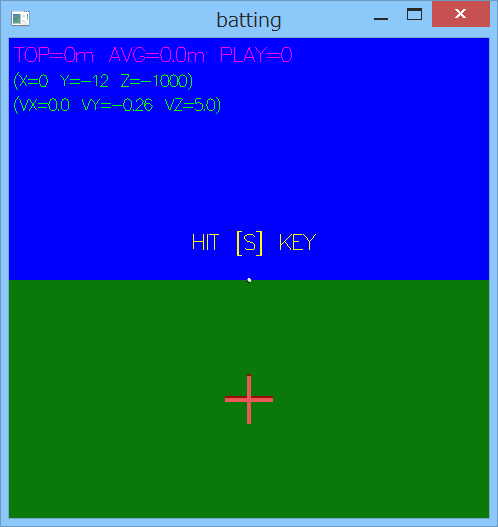
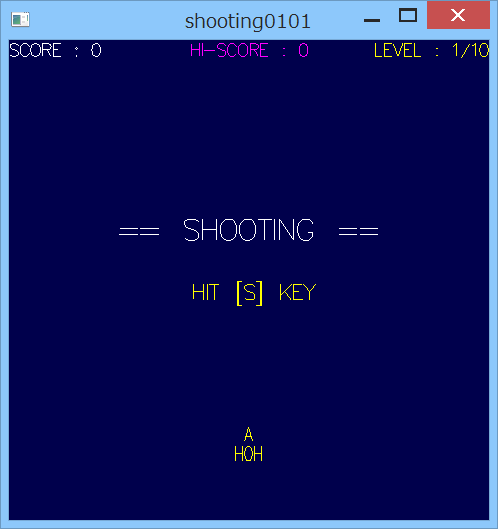

# Gauche-gl-examples







## 概要
- Gauche-gl を使用したサンプルプログラム等です。  
  Gauche-gl は、Gauche から OpenGL を使用するための拡張ライブラリです。


## 内容
1. 内トロコイド曲線 ( trochoid.scm )  
   Gauche-gl を使って、内トロコイド曲線を描くサンプルです。  
   スペースキーを押すと、パラメータを乱数で生成して次を表示します。  
   ESCキーを押すと終了します。

2. 星の表示 ( planet.scm )  
   Gauche-gl を使って、星を表示するサンプルです。  
   ESCキーを押すと終了します。

3. 格闘ゲーム ( fighter.scm )  
   Gauche-gl を使用した、簡単な格闘ゲームです。  
   左側が自分になります。  
   矢印キーで左右移動。[z]キーでパンチ。[x]キーでキックです。  
   防御はありません。相打ちはノーダメージです。  
   パンチ後は下降中が無防備になります。  
   キック後は一定時間無防備になります。  
   Ready?の画面でしばらく待つとデモになります。  
   ESCキーを押すと終了します。

4. バッティングゲーム ( batting.scm )  
   Gauche-gl を使用した、バッティングゲームです。  
   矢印キーでカーソルを左右に移動し、  
   スペースキーでボールを打ちます。  
   引き付けるほど飛びます(最大199m)。ただし見逃しは0mです。  
   ESCキーを押すと終了します。

5. シューティングゲーム ( shooting.scm )  
   Gauche-gl を使用した、簡単なシューティングゲームです。  
   矢印キーで上下左右移動。  
   [Ctrl]/[Space]/[a]/[z]キーのいずれかでビーム発射です(押し続けると発射し続けます)。  
   敵は若干固いので、しばらくビームを当て続ける必要があります。  
   また、敵を破壊すると一定範囲が誘爆します。  
   画面右上のレベル表示は、出現する敵の数と速度の目安になります。  
   また、スタート画面でしばらく待つとデモになります。  
   ESCキーを押すと終了します。


## その他 注意事項等
1. 一部のサンプルは、以下のモジュールに依存しています。同一フォルダに配置してください。
   ```
   glmintool.scm
      Gauche-gl を使うプログラムのための簡単なツール類です。
   gltextscrn.scm
      Gauche-gl を使って文字列の表示等を行うためのモジュールです。
   alaudplay.scm
      Gauche-al を使って音楽を演奏するためのモジュールです。
   ```

2. shooting.scm について、キーボードによっては、キーの同時押しの制限が存在し、  
   斜め移動とスペースキーの同時押しが効かない場合があります。  
   キーの割り当てがたくさんあるのはその回避のためです。  
   (Ctrlキー単独の状態取得は、freeglut の v2.8.0 以後で対応されたもよう)

3. 一部のサンプルに効果音を追加しました。  
   効果音ファイルは、sound フォルダに格納しています。  
   これらは、TAM Music Factory ( http://www.tam-music.com/ ) 様の素材を使用しています。  
   効果音の再生には、OpenAL, freealut, Gauche-al のインストールが必要です。  
   以下のページを参考に、インストールを実施ください。  
   https://github.com/Hamayama/Gauche-al-mg  
   上記インストール後に、xxx_snd.bat (xxxはサンプル名) を実行するか、または、  
   `gosh xxx.scm 1` のように引数を付けて実行すると、効果音付きになります。  
   (Gauche-al が存在しない場合には、効果音なしになります)

4. 各サンプルについての説明をもう少し、以下のページに載せています。  
   http://practical-scheme.net/wiliki/wiliki.cgi?Gauche%3AGauche-gl%E3%82%B5%E3%83%B3%E3%83%97%E3%83%AB


## 環境等
- OS
  - Windows 8.1 (64bit)
- 言語
  - Gauche v0.9.4
  - Gauche v0.9.5_pre1
- 拡張ライブラリ
  - Gauche-gl v0.6
  - Gauche-al v1.0
- 効果音
  - TAM Music Factory ( http://www.tam-music.com/ ) 様

## 履歴
- 1001HISTORY.txt を参照ください。


(2016-4-17)
